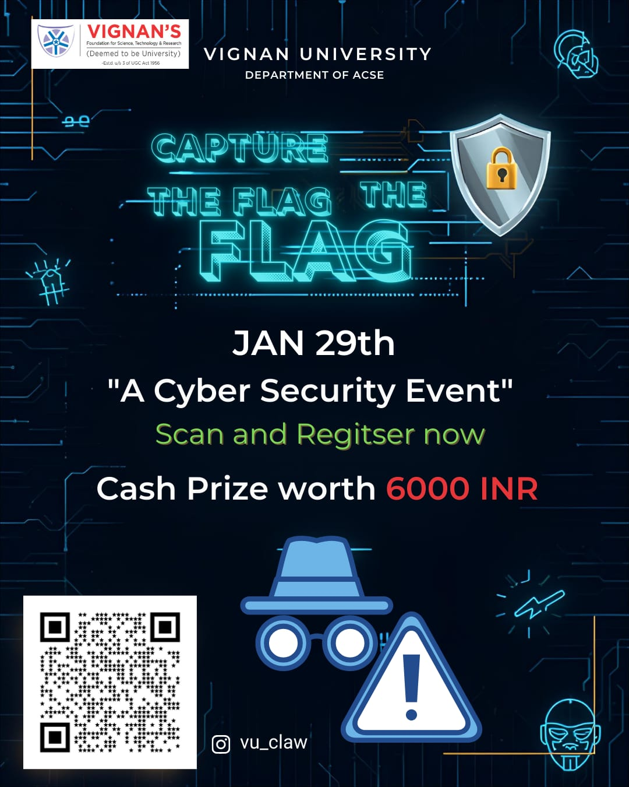

# Chapter Events & Activities

### 🚩 Past Events

#### Capture The Flag (CTF) - Jan 2026
Our chapter organized a major **Capture The Flag** competition at the **Vignan University Department of ACSE**.
* **Date:** January 29th-31st, 2026.
* **Organizer:** Conducted by the CLAW (Cyber Club at Vignan) team.
* **Prize:** Students competed for a cash prize pool of **6000 INR**.
* **Activity:** The event focused on practical cybersecurity challenges and scanning/registration through the official portal.

  

---

### 📅 Future Activities (Coming Soon)

